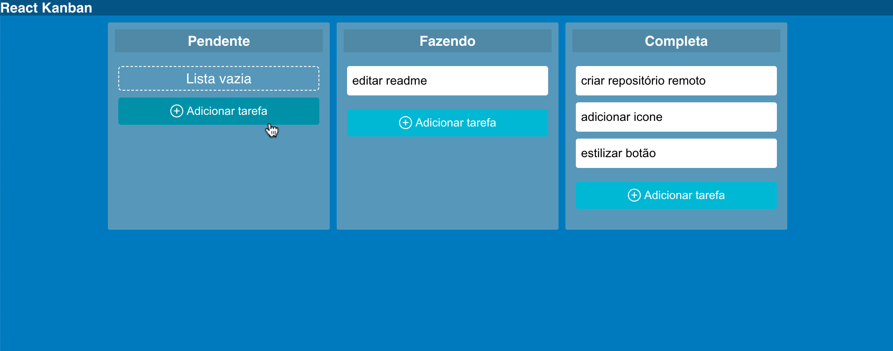

# Kanban - React

Repositório destinado a projeto de Kanban dinâmico e responsivo, usando React.

- Adicionar tarefas na lista
- Atualizar tarefas já adicionadas
- Deletar tarefas indesejadas
- Mover tarefas entre listas

## Feito com
- HTML
- CSS
- JavaScript
- React

Link para o curso [React para Iniciantes](https://www.udemy.com/course/react-para-iniciantes-free)

This project was bootstrapped with [Create React App](https://github.com/facebook/create-react-app).

 